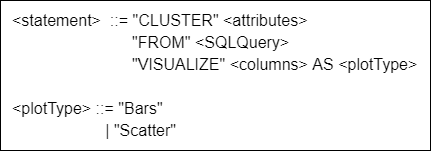

# Syntax of CVQL

A query language syntax implemented using Bison and Flex.

## What is CVQL
CVQL is based on an extension of the SQL language, following the SELECT command, and inspired by the SCCQL language. CVQL focuses on defining a pipeline of tasks: getting data from a database, grouping and visualization.

## Query example



The query consists of three clauses: CLUSTER, FROM and VISUALIZE. In the CLUSTER clause, the <attributes> correspond to the columns that will be used for grouping. Unlike the SELECT statement, it is possible to ignore some attributes that will not be meaningful to grouping but still have them in the query result.

In the FROM clause, the <SQLQuery> refers to the SQL query that must be executed to obtain the table given as input to the clustering algorithm.

The VISUALIZE clause defines in <columns> which columns that will be used for plotting the cluster graphs, while <plotType> refers to the visualization form of the result chosen by the user.

See the example below.


```sql
CLUSTER Population, Percentage
FROM (SELECT c.Name as State, s.Pop as Population,
SUM(c.COVID 19 Deaths) as Total,
SUM(c.COVID 19 Deaths)/s.Pop*100 as Percentage
FROM covid c, states s
WHERE c.Name = s.Name
GROUP BY c.Name, s.Pop)
VISUALIZE Population, Percentage AS Scatter
```

## How to compile

```bash
flex -l test.l
bison -dv test_query.y
gcc -o test $(mysql_config --cflags) test_query.tab.c lex.yy.c -lfl $(mysql_config --libs)
```

## How to execute
```bash
./test
```


## License
[MIT](https://choosealicense.com/licenses/mit/)